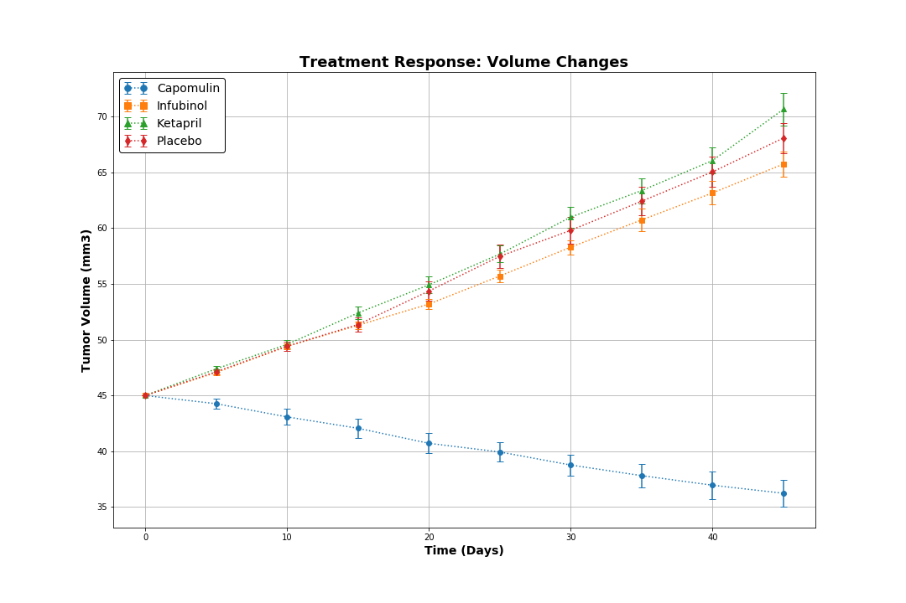
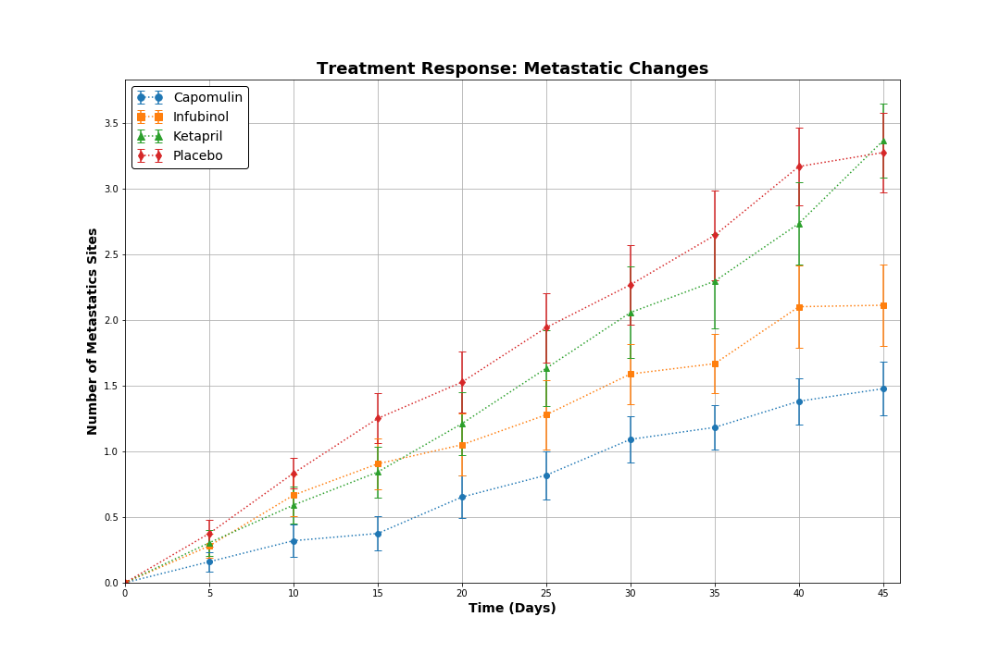
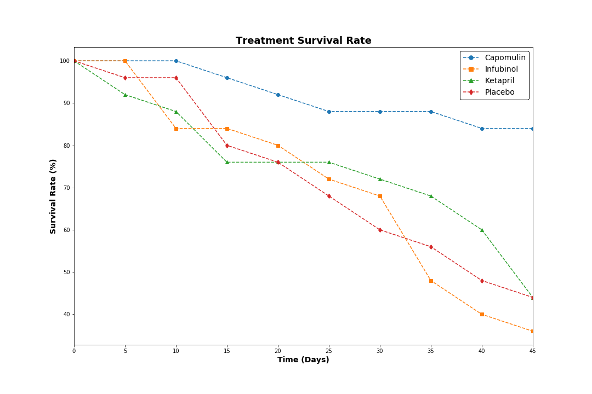
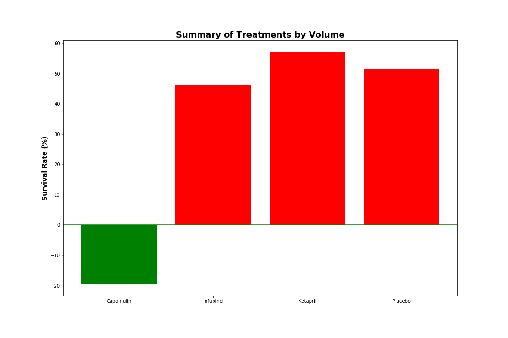

## Pymaceuticals


```python
# Dependencies and Setup
%matplotlib inline
import pandas as pd
import numpy as np
import matplotlib.pyplot as plt

# Raw data file(s)
csv_file = ["Resources/mouse_drug_data.csv", "Resources/clinicaltrial_data.csv"]

# Read data file(s) and store into data frame(s)
clinical_trial_data = pd.read_csv(csv_file[0])
mouse_drug_data = pd.read_csv(csv_file[1])
```


```python
# Clean/Prepare the data
clinical_trial_drug_all = pd.merge(clinical_trial_data, mouse_drug_data)
clinical_trial_drug_data = clinical_trial_drug_all[(clinical_trial_drug_all["Drug"] == 'Capomulin') |
                                                   (clinical_trial_drug_all["Drug"] == 'Infubinol') |
                                                   (clinical_trial_drug_all["Drug"] == 'Ketapril')  |
                                                   (clinical_trial_drug_all["Drug"] == 'Placebo')]

clinical_trial_drug_data.head()
```

<table border="1" class="dataframe">
  <thead>
    <tr style="text-align: right;">
      <th></th>
      <th>Mouse ID</th>
      <th>Drug</th>
      <th>Timepoint</th>
      <th>Tumor Volume (mm3)</th>
      <th>Metastatic Sites</th>
    </tr>
  </thead>
  <tbody>
    <tr>
      <th>393</th>
      <td>q119</td>
      <td>Ketapril</td>
      <td>0</td>
      <td>45.000000</td>
      <td>0</td>
    </tr>
    <tr>
      <th>394</th>
      <td>q119</td>
      <td>Ketapril</td>
      <td>5</td>
      <td>47.864440</td>
      <td>0</td>
    </tr>
    <tr>
      <th>395</th>
      <td>q119</td>
      <td>Ketapril</td>
      <td>10</td>
      <td>51.236606</td>
      <td>0</td>
    </tr>
    <tr>
      <th>396</th>
      <td>n923</td>
      <td>Ketapril</td>
      <td>0</td>
      <td>45.000000</td>
      <td>0</td>
    </tr>
    <tr>
      <th>397</th>
      <td>n923</td>
      <td>Ketapril</td>
      <td>5</td>
      <td>45.824881</td>
      <td>0</td>
    </tr>
  </tbody>
</table>


### Treatment Response: Volume Changes


```python
drug_names = clinical_trial_drug_data.loc[:,["Drug"]]
drug_names = drug_names.drop_duplicates().unstack().values
```


```python
# Store the Mean Tumor Volume Data Grouped by Drug and Timepoint
tumor_volume_mean = pd.DataFrame(clinical_trial_drug_data.groupby(['Drug', 'Timepoint']).mean()['Tumor Volume (mm3)'])
tumor_volume_mean = tumor_volume_mean.unstack(level = 0)
tumor_volume_mean.columns = tumor_volume_mean.columns.get_level_values(1)
tumor_volume_mean
```


<div>
<table border="1" class="dataframe">
  <thead>
    <tr style="text-align: right;">
      <th>Drug</th>
      <th>Capomulin</th>
      <th>Infubinol</th>
      <th>Ketapril</th>
      <th>Placebo</th>
    </tr>
    <tr>
      <th>Timepoint</th>
      <th></th>
      <th></th>
      <th></th>
      <th></th>
    </tr>
  </thead>
  <tbody>
    <tr>
      <th>0</th>
      <td>45.000000</td>
      <td>45.000000</td>
      <td>45.000000</td>
      <td>45.000000</td>
    </tr>
    <tr>
      <th>5</th>
      <td>44.266086</td>
      <td>47.062001</td>
      <td>47.389175</td>
      <td>47.125589</td>
    </tr>
    <tr>
      <th>10</th>
      <td>43.084291</td>
      <td>49.403909</td>
      <td>49.582269</td>
      <td>49.423329</td>
    </tr>
    <tr>
      <th>15</th>
      <td>42.064317</td>
      <td>51.296397</td>
      <td>52.399974</td>
      <td>51.359742</td>
    </tr>
    <tr>
      <th>20</th>
      <td>40.716325</td>
      <td>53.197691</td>
      <td>54.920935</td>
      <td>54.364417</td>
    </tr>
    <tr>
      <th>25</th>
      <td>39.939528</td>
      <td>55.715252</td>
      <td>57.678982</td>
      <td>57.482574</td>
    </tr>
    <tr>
      <th>30</th>
      <td>38.769339</td>
      <td>58.299397</td>
      <td>60.994507</td>
      <td>59.809063</td>
    </tr>
    <tr>
      <th>35</th>
      <td>37.816839</td>
      <td>60.742461</td>
      <td>63.371686</td>
      <td>62.420615</td>
    </tr>
    <tr>
      <th>40</th>
      <td>36.958001</td>
      <td>63.162824</td>
      <td>66.068580</td>
      <td>65.052675</td>
    </tr>
    <tr>
      <th>45</th>
      <td>36.236114</td>
      <td>65.755562</td>
      <td>70.662958</td>
      <td>68.084082</td>
    </tr>
  </tbody>
</table>
</div>


```python
# Store the Standard Error of Tumor Volumes Grouped by Drug and Timepoint
tumor_volume_sem = pd.DataFrame(clinical_trial_drug_data.groupby(['Drug', 'Timepoint']).sem()['Tumor Volume (mm3)'])
tumor_volume_sem = tumor_volume_sem.unstack(level=0)
tumor_volume_sem.columns = tumor_volume_sem.columns.get_level_values(1)
tumor_volume_sem
```


<div>
<table border="1" class="dataframe">
  <thead>
    <tr style="text-align: right;">
      <th>Drug</th>
      <th>Capomulin</th>
      <th>Infubinol</th>
      <th>Ketapril</th>
      <th>Placebo</th>
    </tr>
    <tr>
      <th>Timepoint</th>
      <th></th>
      <th></th>
      <th></th>
      <th></th>
    </tr>
  </thead>
  <tbody>
    <tr>
      <th>0</th>
      <td>0.000000</td>
      <td>0.000000</td>
      <td>0.000000</td>
      <td>0.000000</td>
    </tr>
    <tr>
      <th>5</th>
      <td>0.448593</td>
      <td>0.235102</td>
      <td>0.264819</td>
      <td>0.218091</td>
    </tr>
    <tr>
      <th>10</th>
      <td>0.702684</td>
      <td>0.282346</td>
      <td>0.357421</td>
      <td>0.402064</td>
    </tr>
    <tr>
      <th>15</th>
      <td>0.838617</td>
      <td>0.357705</td>
      <td>0.580268</td>
      <td>0.614461</td>
    </tr>
    <tr>
      <th>20</th>
      <td>0.909731</td>
      <td>0.476210</td>
      <td>0.726484</td>
      <td>0.839609</td>
    </tr>
    <tr>
      <th>25</th>
      <td>0.881642</td>
      <td>0.550315</td>
      <td>0.755413</td>
      <td>1.034872</td>
    </tr>
    <tr>
      <th>30</th>
      <td>0.934460</td>
      <td>0.631061</td>
      <td>0.934121</td>
      <td>1.218231</td>
    </tr>
    <tr>
      <th>35</th>
      <td>1.052241</td>
      <td>0.984155</td>
      <td>1.127867</td>
      <td>1.287481</td>
    </tr>
    <tr>
      <th>40</th>
      <td>1.223608</td>
      <td>1.055220</td>
      <td>1.158449</td>
      <td>1.370634</td>
    </tr>
    <tr>
      <th>45</th>
      <td>1.223977</td>
      <td>1.144427</td>
      <td>1.453186</td>
      <td>1.351726</td>
    </tr>
  </tbody>
</table>
</div>


```python
# Generate the Plot (with Error Bars)
plt.figure(figsize = (15,10))
plt.title("Treatment Response: Volume Changes",fontdict = {'fontsize': 18, 'fontweight': 'bold'})
plt.ylabel("Tumor Volume (mm3)", fontdict = {'fontsize': 14, 'fontweight': 'bold'})
plt.xlabel("Time (Days)", fontdict = {'fontsize': 14, 'fontweight': 'bold'})
plt.grid(True)

# markers used throughout 
markers = ['o', 's', '^', 'd']

# timepoints
x_axis = tumor_volume_mean.index

# count the markers
count = 0

# plot each volume column with standard error
for c in tumor_volume_mean.columns:
    plt.errorbar(x_axis, 
                 tumor_volume_mean[c], 
                 tumor_volume_sem[c],
                 linestyle = ':', 
                 marker =  markers[count], 
                 capthick = 1,
                 capsize = 4)
    count += 1

# Legend
lg = plt.legend(numpoints = 2,
                frameon = True, 
                markerscale = 1.25, 
                edgecolor = 'black', 
                fontsize = '14', 
                framealpha = 1)

plt.savefig("Resources/Treatment.Response.Volume.Changes.png")
plt.show()
```





### Treatment Response: Metastatic Changes


```python
# Metastatic Data - averages
tumor_spread_mean = pd.DataFrame(clinical_trial_drug_data.groupby(['Drug', 'Timepoint']).mean()['Metastatic Sites'])
tumor_spread_mean = tumor_spread_mean.unstack(level=0)
tumor_spread_mean.columns = tumor_spread_mean.columns.get_level_values(level=1)
tumor_spread_mean
```


<div>
<table border="1" class="dataframe">
  <thead>
    <tr style="text-align: right;">
      <th>Drug</th>
      <th>Capomulin</th>
      <th>Infubinol</th>
      <th>Ketapril</th>
      <th>Placebo</th>
    </tr>
    <tr>
      <th>Timepoint</th>
      <th></th>
      <th></th>
      <th></th>
      <th></th>
    </tr>
  </thead>
  <tbody>
    <tr>
      <th>0</th>
      <td>0.000000</td>
      <td>0.000000</td>
      <td>0.000000</td>
      <td>0.000000</td>
    </tr>
    <tr>
      <th>5</th>
      <td>0.160000</td>
      <td>0.280000</td>
      <td>0.304348</td>
      <td>0.375000</td>
    </tr>
    <tr>
      <th>10</th>
      <td>0.320000</td>
      <td>0.666667</td>
      <td>0.590909</td>
      <td>0.833333</td>
    </tr>
    <tr>
      <th>15</th>
      <td>0.375000</td>
      <td>0.904762</td>
      <td>0.842105</td>
      <td>1.250000</td>
    </tr>
    <tr>
      <th>20</th>
      <td>0.652174</td>
      <td>1.050000</td>
      <td>1.210526</td>
      <td>1.526316</td>
    </tr>
    <tr>
      <th>25</th>
      <td>0.818182</td>
      <td>1.277778</td>
      <td>1.631579</td>
      <td>1.941176</td>
    </tr>
    <tr>
      <th>30</th>
      <td>1.090909</td>
      <td>1.588235</td>
      <td>2.055556</td>
      <td>2.266667</td>
    </tr>
    <tr>
      <th>35</th>
      <td>1.181818</td>
      <td>1.666667</td>
      <td>2.294118</td>
      <td>2.642857</td>
    </tr>
    <tr>
      <th>40</th>
      <td>1.380952</td>
      <td>2.100000</td>
      <td>2.733333</td>
      <td>3.166667</td>
    </tr>
    <tr>
      <th>45</th>
      <td>1.476190</td>
      <td>2.111111</td>
      <td>3.363636</td>
      <td>3.272727</td>
    </tr>
  </tbody>
</table>
</div>


```python
# Metastatic Data - standard error
tumor_spread_sem = pd.DataFrame(clinical_trial_drug_data.groupby(['Drug', 'Timepoint']).sem()['Metastatic Sites'])
tumor_spread_sem = tumor_spread_sem.unstack(level = 0)
tumor_spread_sem.columns = tumor_spread_sem.columns.get_level_values(level = 1)
tumor_spread_sem
```


<div>
<table border="1" class="dataframe">
  <thead>
    <tr style="text-align: right;">
      <th>Drug</th>
      <th>Capomulin</th>
      <th>Infubinol</th>
      <th>Ketapril</th>
      <th>Placebo</th>
    </tr>
    <tr>
      <th>Timepoint</th>
      <th></th>
      <th></th>
      <th></th>
      <th></th>
    </tr>
  </thead>
  <tbody>
    <tr>
      <th>0</th>
      <td>0.000000</td>
      <td>0.000000</td>
      <td>0.000000</td>
      <td>0.000000</td>
    </tr>
    <tr>
      <th>5</th>
      <td>0.074833</td>
      <td>0.091652</td>
      <td>0.098100</td>
      <td>0.100947</td>
    </tr>
    <tr>
      <th>10</th>
      <td>0.125433</td>
      <td>0.159364</td>
      <td>0.142018</td>
      <td>0.115261</td>
    </tr>
    <tr>
      <th>15</th>
      <td>0.132048</td>
      <td>0.194015</td>
      <td>0.191381</td>
      <td>0.190221</td>
    </tr>
    <tr>
      <th>20</th>
      <td>0.161621</td>
      <td>0.234801</td>
      <td>0.236680</td>
      <td>0.234064</td>
    </tr>
    <tr>
      <th>25</th>
      <td>0.181818</td>
      <td>0.265753</td>
      <td>0.288275</td>
      <td>0.263888</td>
    </tr>
    <tr>
      <th>30</th>
      <td>0.172944</td>
      <td>0.227823</td>
      <td>0.347467</td>
      <td>0.300264</td>
    </tr>
    <tr>
      <th>35</th>
      <td>0.169496</td>
      <td>0.224733</td>
      <td>0.361418</td>
      <td>0.341412</td>
    </tr>
    <tr>
      <th>40</th>
      <td>0.175610</td>
      <td>0.314466</td>
      <td>0.315725</td>
      <td>0.297294</td>
    </tr>
    <tr>
      <th>45</th>
      <td>0.202591</td>
      <td>0.309320</td>
      <td>0.278722</td>
      <td>0.304240</td>
    </tr>
  </tbody>
</table>
</div>


```python
# Generate the Plot (with Error Bars)
plt.figure(figsize = (15,10))
plt.title("Treatment Response: Metastatic Changes",fontdict = {'fontsize': 18, 'fontweight': 'bold'})
plt.ylabel("Number of Metastatics Sites", fontdict = {'fontsize': 14, 'fontweight': 'bold'})
plt.xlabel("Time (Days)", fontdict = {'fontsize': 14, 'fontweight': 'bold'})
plt.xticks(np.arange(0,tumor_spread_mean.index.max() + 3 ,5))
plt.xlim(0, tumor_spread_mean.index.max()+1)
plt.ylim(0, tumor_spread_mean.max().max() + tumor_spread_sem.max().max() + .1)
plt.grid(True)

# timepoints
x_axis = tumor_spread_mean.index

# count the markers
count = 0

# plot each volume column with standard error
for c in tumor_volume_mean.columns:
    plt.errorbar(x_axis, 
                 tumor_spread_mean[c], 
                 tumor_spread_sem[c],
                 linestyle = ':', 
                 marker =  markers[count], 
                 capthick = 1,
                 capsize = 4)
    count += 1

# Legend
lg = plt.legend(numpoints = 2,
                frameon = True, 
                markerscale = 1.25, 
                edgecolor = 'black', 
                fontsize = '14', 
                framealpha = 1)

plt.savefig("Resources/Treatment.Response.Metastatic.Changes.png")
plt.show()
```





### Treatment Survival Rate


```python
# Survival Rate -- how many mice made it
mice_count = clinical_trial_drug_data.groupby(['Drug', 'Timepoint']).count()['Mouse ID']
mice_count = mice_count.unstack(level = 0)
mice_count
```


<div>
<table border="1" class="dataframe">
  <thead>
    <tr style="text-align: right;">
      <th>Drug</th>
      <th>Capomulin</th>
      <th>Infubinol</th>
      <th>Ketapril</th>
      <th>Placebo</th>
    </tr>
    <tr>
      <th>Timepoint</th>
      <th></th>
      <th></th>
      <th></th>
      <th></th>
    </tr>
  </thead>
  <tbody>
    <tr>
      <th>0</th>
      <td>25</td>
      <td>25</td>
      <td>25</td>
      <td>25</td>
    </tr>
    <tr>
      <th>5</th>
      <td>25</td>
      <td>25</td>
      <td>23</td>
      <td>24</td>
    </tr>
    <tr>
      <th>10</th>
      <td>25</td>
      <td>21</td>
      <td>22</td>
      <td>24</td>
    </tr>
    <tr>
      <th>15</th>
      <td>24</td>
      <td>21</td>
      <td>19</td>
      <td>20</td>
    </tr>
    <tr>
      <th>20</th>
      <td>23</td>
      <td>20</td>
      <td>19</td>
      <td>19</td>
    </tr>
    <tr>
      <th>25</th>
      <td>22</td>
      <td>18</td>
      <td>19</td>
      <td>17</td>
    </tr>
    <tr>
      <th>30</th>
      <td>22</td>
      <td>17</td>
      <td>18</td>
      <td>15</td>
    </tr>
    <tr>
      <th>35</th>
      <td>22</td>
      <td>12</td>
      <td>17</td>
      <td>14</td>
    </tr>
    <tr>
      <th>40</th>
      <td>21</td>
      <td>10</td>
      <td>15</td>
      <td>12</td>
    </tr>
    <tr>
      <th>45</th>
      <td>21</td>
      <td>9</td>
      <td>11</td>
      <td>11</td>
    </tr>
  </tbody>
</table>
</div>


```python
# Generate the Plot
plt.figure(figsize = (15,10))
plt.title("Treatment Survival Rate",fontdict = {'fontsize': 18, 'fontweight': 'bold'})
plt.ylabel("Survival Rate (%)", fontdict = {'fontsize': 14, 'fontweight': 'bold'})
plt.xlabel("Time (Days)", fontdict = {'fontsize': 14, 'fontweight': 'bold'})
plt.xlim(0, mice_count.index.max())

# timepoints
x_axis = mice_count.index

# count the markers
count = 0 

for c in mice_count:
    y_axis = mice_count[c]/mice_count.loc[0,c] * 100 #calculates survival rate for each timepoint
    plt.plot(x_axis, 
             y_axis, 
             linestyle = '--', 
             marker =  markers[count])
    count += 1

# Legend
lg = plt.legend(numpoints = 1,
                frameon = True, 
                markerscale = 1.25, 
                edgecolor = 'black', 
                fontsize = '14', 
                framealpha = 1)

plt.savefig("Resources/Treatment.Survival.Rate.png")
plt.show()
```





### Summary of Treatments by Volume


```python
tumor_change = (tumor_volume_mean.loc[45, :] - tumor_volume_mean.loc[0, :])/tumor_volume_mean.loc[0, :] * 100
tumor_change
```


    Drug
    Capomulin   -19.475303
    Infubinol    46.123472
    Ketapril     57.028795
    Placebo      51.297960
    dtype: float64


```python
# Generate the Plot
x_labels = tumor_change.index

plt.figure(figsize = (15,10))
plt.title("Summary of Treatments by Volume",fontdict = {'fontsize': 18, 'fontweight': 'bold'})
plt.ylabel("Survival Rate (%)", fontdict = {'fontsize': 14, 'fontweight': 'bold'})
plt.xticks(np.arange(len(x_labels)), x_labels)
plt.axhline(y=0, color = 'green')

plt.bar(np.arange(4), 
        tumor_change, 
        color = ['red' if tumor_change[r] > 0 else 'green' for r in np.arange(len(x_labels))])

plt.savefig("Resources/Treatment.Summary.png")
plt.show()
```





### Observable Trends
>Over the trial, Capomulin would be the recommend drug for treatment as it had the highest rate of survival lowest mestatic response and the most effective response to treatment.

>Oddly, the drug Ketapril and the Placebo show the same statistics in all three categories. It is a possible conclusion that both drugs share similar components. The surival rates are comparable to the placebo at the end of the treatment.

>Infubinal would be the worst.  This group, however, experienced the lowest surival rates of the two other treatments and the placebo.     
	