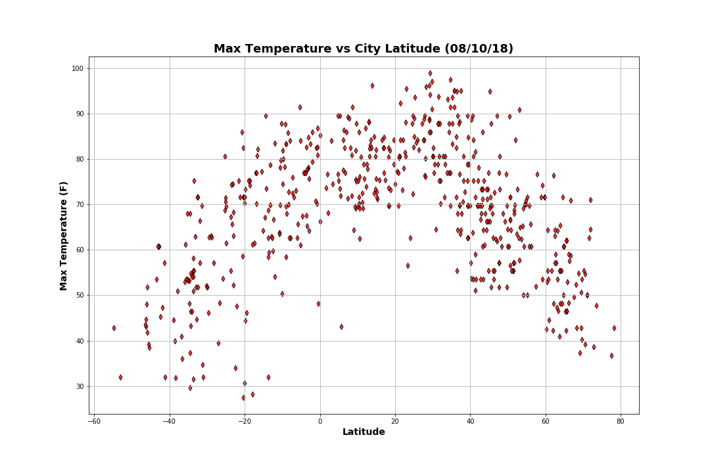
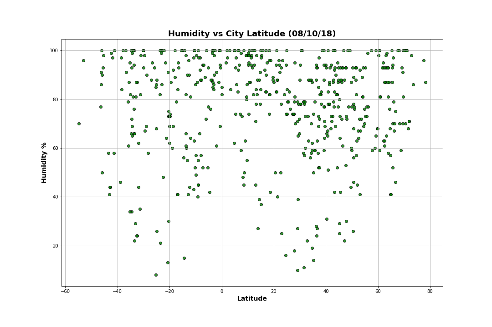
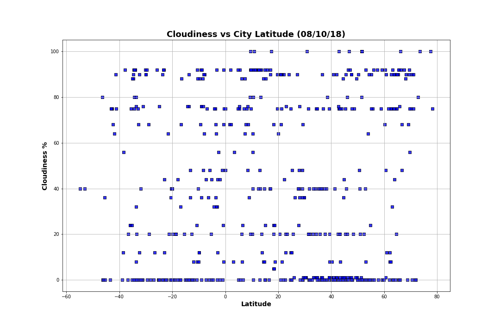
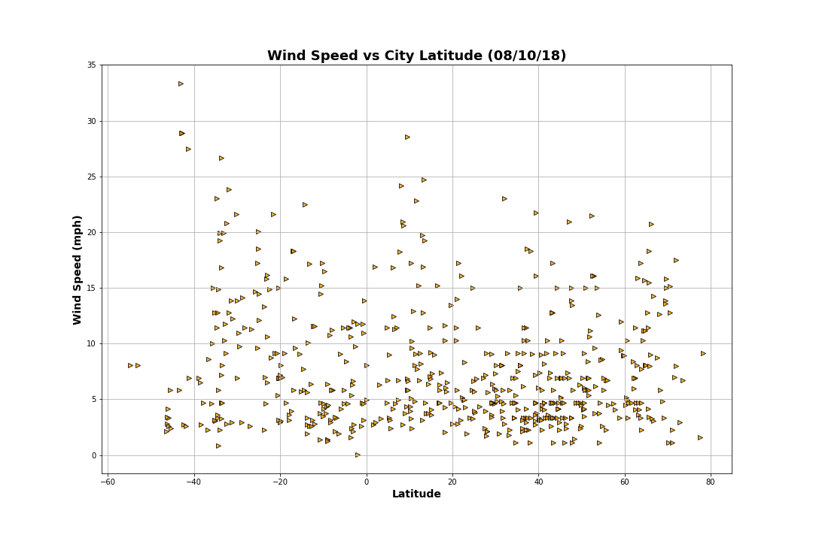

# WeatherPy


```python
# Dependencies and Setup
import re, os, json, time, requests
import matplotlib.pyplot as plt
import pandas as pd
import numpy as np

# Import logging and config
import logging, LOGS
from configparser import ConfigParser

# Incorporated citipy to determine city based on latitude and longitude
from citipy import citipy
```


```python
ini_conf = 'conf/config.ini'
log_conf = 'conf/logger.conf'

# Execute config functionality
config = ConfigParser()
config.read(ini_conf)

# Execute logging functionality
LOGGER = logging.getLogger(__name__)
LOGS.init_logging(log_conf)
```


```python
# Output File (CSV)
output_data_file = config.get('filepaths', 'weather_output')
```


```python
# Range of latitudes and longitudes
lat_range = (-90, 90)
long_range = (-180, 180)
```

## Generate Cities List


```python
LOGGER.info('Generate Cities List')

# List for holding lat_lngs and cities
lat_longs = []
cities = []

seed_size=1500

# Create a set of random lat and lng combinations
lats = np.random.uniform(low=-90.000, high=90.000, size=seed_size)
longs = np.random.uniform(low=-180.000, high=180.000, size=seed_size)
lat_longs = zip(lats, longs)

# Identify nearest city for each lat, long combination
for lat_long in lat_longs:
    city = citipy.nearest_city(lat_long[0], lat_long[1]).city_name
    if city not in cities:
        cities.append(city)

LOGGER.info('Count of cities: {}'.format(len(cities)))        
```

    2018-08-10 04:39:11,588 [ __main__ ] ~INFO~ Generate Cities List
    2018-08-10 04:39:12,740 [ __main__ ] ~INFO~ Count of cities: 625


## Perform API Calls


```python
# OpenWeatherMap Config
api_url = config.get('OpenWeatherMap', 'url')
key_value = config.get('OpenWeatherMap', 'key')
units_value = config.get('OpenWeatherMap', 'units')

# OpenWeatherMap API Call(s)
cities_weather_data = []

for city in cities:
    query_parms = {'units': units_value, 'APPID': key_value, 'q': city}
    resp = requests.get(api_url, params=query_parms)
    result = resp.json()
    
    LOGGER.info('Request status: {} for {}'.format(resp.status_code, city))
    LOGGER.info('Request URL: {}'.format(resp.url))
    
    if resp.status_code == requests.codes.ok:
        cities_weather_data.append({ "ID": result["id"],
                                     "City": result["name"],
                                     "Lat": result["coord"]["lat"],
                                     "Long": result["coord"]["lon"],
                                     "Max Temp": result["main"]["temp_max"],
                                     "Humidity": result["main"]["humidity"],
                                     "Cloudiness": result["clouds"]["all"],
                                     "Wind Speed": result["wind"]["speed"],
                                     "Country": result["sys"]["country"],
                                     "Date": result["dt"] })
    else:
        LOGGER.error('City was not found: {}'.format(city))

    # deplay for API; limit 60 calls/minute
    time.sleep(1)
```


```python
cities_weather = pd.DataFrame(cities_weather_data).set_index(["ID"])
cities_weather.to_csv(output_data_file)
cities_weather.head()
```


<div>
<table border="1" class="dataframe">
  <thead>
    <tr style="text-align: right;">
      <th></th>
      <th>City</th>
      <th>Cloudiness</th>
      <th>Country</th>
      <th>Date</th>
      <th>Humidity</th>
      <th>Lat</th>
      <th>Long</th>
      <th>Max Temp</th>
      <th>Wind Speed</th>
    </tr>
    <tr>
      <th>ID</th>
      <th></th>
      <th></th>
      <th></th>
      <th></th>
      <th></th>
      <th></th>
      <th></th>
      <th></th>
      <th></th>
    </tr>
  </thead>
  <tbody>
    <tr>
      <th>4030556</th>
      <td>Rikitea</td>
      <td>92</td>
      <td>PF</td>
      <td>1533875964</td>
      <td>99</td>
      <td>-23.12</td>
      <td>-134.97</td>
      <td>74.45</td>
      <td>15.79</td>
    </tr>
    <tr>
      <th>3421193</th>
      <td>Paamiut</td>
      <td>0</td>
      <td>GL</td>
      <td>1533875844</td>
      <td>95</td>
      <td>61.99</td>
      <td>-49.67</td>
      <td>42.32</td>
      <td>8.41</td>
    </tr>
    <tr>
      <th>3874787</th>
      <td>Punta Arenas</td>
      <td>40</td>
      <td>CL</td>
      <td>1533873600</td>
      <td>96</td>
      <td>-53.16</td>
      <td>-70.91</td>
      <td>32.00</td>
      <td>8.05</td>
    </tr>
    <tr>
      <th>6201424</th>
      <td>Mataura</td>
      <td>0</td>
      <td>NZ</td>
      <td>1533875713</td>
      <td>91</td>
      <td>-46.19</td>
      <td>168.86</td>
      <td>43.13</td>
      <td>2.82</td>
    </tr>
    <tr>
      <th>104515</th>
      <td>Mecca</td>
      <td>8</td>
      <td>SA</td>
      <td>1533875968</td>
      <td>40</td>
      <td>21.43</td>
      <td>39.83</td>
      <td>92.27</td>
      <td>4.16</td>
    </tr>
  </tbody>
</table>
</div>


***


```python
cloudiness = cities_weather["Cloudiness"]
humidity = cities_weather["Humidity"]
lats = cities_weather["Lat"]
max_temps = cities_weather["Max Temp"]
wind_speed = cities_weather["Wind Speed"]
```

## Temperature (F) vs. Latitude


```python
# Generate the Plot
plt.figure(figsize = (15,10))
plt.title("Max Temperature vs City Latitude (%s)" % time.strftime("%x"),fontdict = {'fontsize': 18, 'fontweight': 'bold'})
plt.ylabel("Max Temperature (F)", fontdict = {'fontsize': 14, 'fontweight': 'bold'})
plt.xlabel("Latitude", fontdict = {'fontsize': 14, 'fontweight': 'bold'})
plt.grid(True)

# Build scatter plot for latitude vs. temperature
plt.scatter(lats,
            max_temps,
            color="red",
            edgecolor="black",
            linewidths=1,
            marker="d",
            alpha=0.8,
            label="Cities")

plt.savefig("Resources/Temperature.Latitude.png")
plt.show()
```





## Humidity (%) vs. Latitude


```python
# Generate the Plot
plt.figure(figsize = (15,10))
plt.title("Humidity vs City Latitude (%s)" % time.strftime("%x"),fontdict = {'fontsize': 18, 'fontweight': 'bold'})
plt.ylabel("Humidity %", fontdict = {'fontsize': 14, 'fontweight': 'bold'})
plt.xlabel("Latitude", fontdict = {'fontsize': 14, 'fontweight': 'bold'})
plt.grid(True)

# Build scatter plot for latitude vs. temperature
plt.scatter(lats,
            humidity,
            color="green",
            edgecolor="black",
            linewidths=1,
            marker="o",
            alpha=0.8,
            label="Cities")

plt.savefig("Resources/Humidity.Latitude.png")
plt.show()
```





## Cloudiness (%) vs. Latitude


```python
# Generate the Plot
plt.figure(figsize = (15,10))
plt.title("Cloudiness vs City Latitude (%s)" % time.strftime("%x"),fontdict = {'fontsize': 18, 'fontweight': 'bold'})
plt.ylabel("Cloudiness %", fontdict = {'fontsize': 14, 'fontweight': 'bold'})
plt.xlabel("Latitude", fontdict = {'fontsize': 14, 'fontweight': 'bold'})
plt.grid(True)

# Build scatter plot for latitude vs. temperature
plt.scatter(lats,
            cloudiness,
            color="blue",
            edgecolor="black",
            linewidths=1,
            marker="s",
            alpha=0.8,
            label="Cities")

plt.savefig("Resources/Cloudiness.Latitude.png")
plt.show()
```





## Wind Speed (mph) vs. Latitude


```python
# Generate the Plot
plt.figure(figsize = (15,10))
plt.title("Wind Speed vs City Latitude (%s)" % time.strftime("%x"),fontdict = {'fontsize': 18, 'fontweight': 'bold'})
plt.ylabel("Wind Speed (mph)", fontdict = {'fontsize': 14, 'fontweight': 'bold'})
plt.xlabel("Latitude", fontdict = {'fontsize': 14, 'fontweight': 'bold'})
plt.grid(True)

# Build scatter plot for latitude vs. temperature
plt.scatter(lats,
            wind_speed,
            color="orange",
            edgecolor="black",
            linewidths=1,
            marker=">",
            alpha=0.8,
            label="Cities")

plt.savefig("Resources/WindSpeed.Latitude.png")
plt.show()
```




