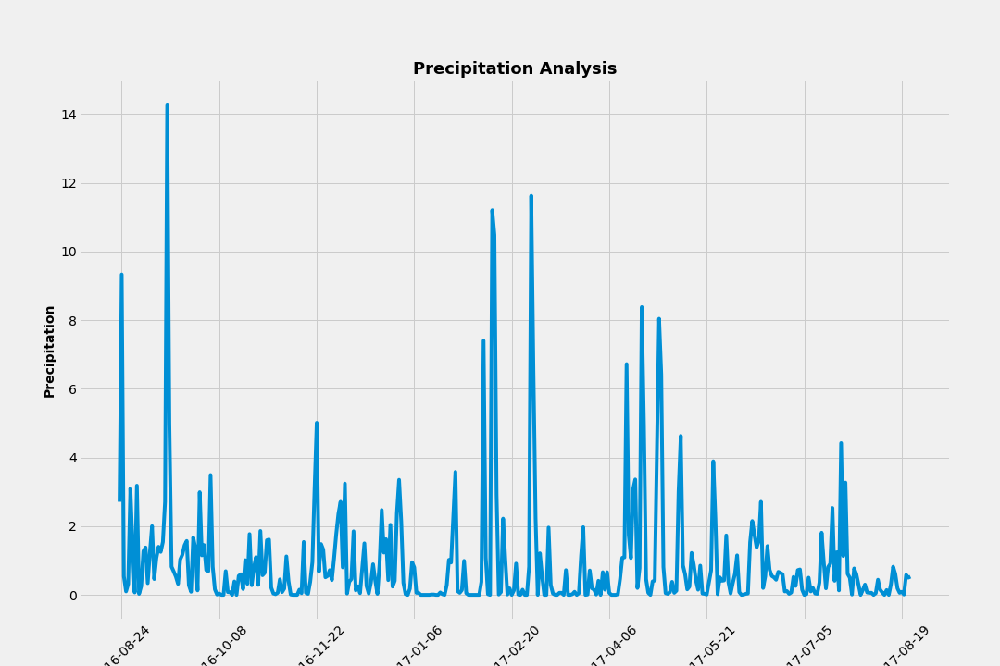
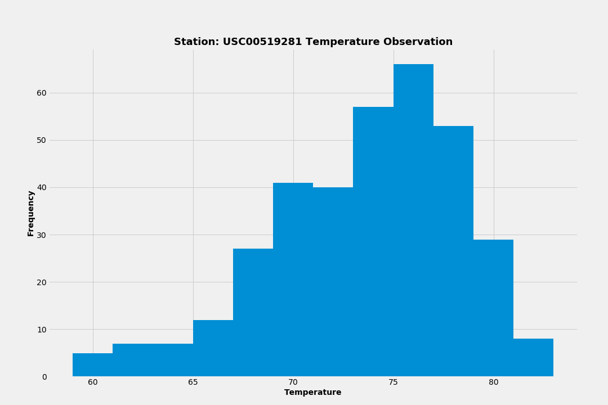

# Surfs Up! - Analysis


```python
# Dependencies and Setup
import matplotlib.pyplot as plt
import numpy as np
import pandas as pd
import datetime as dt
```


```python
from matplotlib import style
style.use('fivethirtyeight')
```


```python
 # Python SQL toolkit and Object Relational Mapper
import sqlalchemy
from sqlalchemy.ext.automap import automap_base
from sqlalchemy.orm import Session
from sqlalchemy import create_engine, func
```


```python
engine = create_engine('sqlite:///Resources/hawaii.sqlite')
```


```python
Base = automap_base()
Base.prepare(engine, reflect=True)

Station = Base.classes.station
Measurement = Base.classes.measurement
```


```python
session = Session(engine)
```

### Precipitation Analysis


```python
end_date   = '2017-08-23'
start_date = (dt.datetime.strptime(end_date, '%Y-%m-%d') + dt.timedelta(days=-365)).strftime('%Y-%m-%d')

print('start date: {}'.format(start_date))
print('end date  : {}'.format(end_date))
```

    start date: 2016-08-23
    end date  : 2017-08-23


```python
sql_results = session.query(Measurement.date, Measurement.prcp) \
                     .filter(Measurement.date >= start_date) \
                     .filter(Measurement.date <= end_date) \
                     .filter(Measurement.prcp != None) \
                     .order_by(Measurement.date.asc()).all()
```


```python
len(sql_results)
```


    2021


```python
precipitation_df = pd.DataFrame(sql_results, columns=['date', 'prcp'])
precipitation_df.head()
```


<div>
<table border="1" class="dataframe">
  <thead>
    <tr style="text-align: right;">
      <th></th>
      <th>date</th>
      <th>prcp</th>
    </tr>
  </thead>
  <tbody>
    <tr>
      <th>0</th>
      <td>2016-08-23</td>
      <td>0.00</td>
    </tr>
    <tr>
      <th>1</th>
      <td>2016-08-23</td>
      <td>0.15</td>
    </tr>
    <tr>
      <th>2</th>
      <td>2016-08-23</td>
      <td>0.05</td>
    </tr>
    <tr>
      <th>3</th>
      <td>2016-08-23</td>
      <td>0.02</td>
    </tr>
    <tr>
      <th>4</th>
      <td>2016-08-23</td>
      <td>1.79</td>
    </tr>
  </tbody>
</table>
</div>


```python
precipitation_sum_df = pd.DataFrame(precipitation_df.groupby(['date']).sum())
```


```python
precipitation_sum_df.head()
```


<div>
<table border="1" class="dataframe">
  <thead>
    <tr style="text-align: right;">
      <th></th>
      <th>prcp</th>
    </tr>
    <tr>
      <th>date</th>
      <th></th>
    </tr>
  </thead>
  <tbody>
    <tr>
      <th>2016-08-23</th>
      <td>2.71</td>
    </tr>
    <tr>
      <th>2016-08-24</th>
      <td>9.33</td>
    </tr>
    <tr>
      <th>2016-08-25</th>
      <td>0.54</td>
    </tr>
    <tr>
      <th>2016-08-26</th>
      <td>0.10</td>
    </tr>
    <tr>
      <th>2016-08-27</th>
      <td>0.32</td>
    </tr>
  </tbody>
</table>
</div>


```python
x_axis = precipitation_sum_df.index.values
y_axis = precipitation_sum_df['prcp']
```


```python
# Generate the Plot
plt.figure(figsize = (15,10))
plt.title("Precipitation Analysis",fontdict = {'fontsize': 18, 'fontweight': 'bold'})
plt.ylabel("Precipitation", fontdict = {'fontsize': 14, 'fontweight': 'bold'})
plt.xlabel("Dates", fontdict = {'fontsize': 14, 'fontweight': 'bold'})
plt.xticks(np.arange(1,369,step=45))
plt.xticks(rotation=45)
plt.grid(True)

plt.plot(x_axis, y_axis)
plt.savefig("Resources/Precipitation.Analysis.png")
plt.show()
```





```python
precipitation_df.describe()
```


<div>
<table border="1" class="dataframe">
  <thead>
    <tr style="text-align: right;">
      <th></th>
      <th>prcp</th>
    </tr>
  </thead>
  <tbody>
    <tr>
      <th>count</th>
      <td>2021.000000</td>
    </tr>
    <tr>
      <th>mean</th>
      <td>0.177279</td>
    </tr>
    <tr>
      <th>std</th>
      <td>0.461190</td>
    </tr>
    <tr>
      <th>min</th>
      <td>0.000000</td>
    </tr>
    <tr>
      <th>25%</th>
      <td>0.000000</td>
    </tr>
    <tr>
      <th>50%</th>
      <td>0.020000</td>
    </tr>
    <tr>
      <th>75%</th>
      <td>0.130000</td>
    </tr>
    <tr>
      <th>max</th>
      <td>6.700000</td>
    </tr>
  </tbody>
</table>
</div>


```python
precipitation_sum_df.describe()
```


<div>
<table border="1" class="dataframe">
  <thead>
    <tr style="text-align: right;">
      <th></th>
      <th>prcp</th>
    </tr>
  </thead>
  <tbody>
    <tr>
      <th>count</th>
      <td>366.000000</td>
    </tr>
    <tr>
      <th>mean</th>
      <td>0.978907</td>
    </tr>
    <tr>
      <th>std</th>
      <td>1.776349</td>
    </tr>
    <tr>
      <th>min</th>
      <td>0.000000</td>
    </tr>
    <tr>
      <th>25%</th>
      <td>0.052500</td>
    </tr>
    <tr>
      <th>50%</th>
      <td>0.405000</td>
    </tr>
    <tr>
      <th>75%</th>
      <td>1.087500</td>
    </tr>
    <tr>
      <th>max</th>
      <td>14.280000</td>
    </tr>
  </tbody>
</table>
</div>


### Station Analysis


```python
total_stations = session.query(Station.station).count()
```


```python
print('Total Stations:  {}'.format(total_stations))
```

    Total Stations:  9


```python
sql_results = session.query(Measurement.station, Station.name, func.count(Measurement.tobs)) \
                     .filter(Measurement.station == Station.station) \
                     .group_by(Measurement.station) \
                     .order_by(func.count(Measurement.tobs) \
                     .desc()).statement
```


```python
stations_df = pd.read_sql_query(sql_results, session.bind)
stations_df = stations_df.rename(columns = {'count_1':'count'})
```


```python
stations_df
```


<div>
<table border="1" class="dataframe">
  <thead>
    <tr style="text-align: right;">
      <th></th>
      <th>station</th>
      <th>name</th>
      <th>count</th>
    </tr>
  </thead>
  <tbody>
    <tr>
      <th>0</th>
      <td>USC00519281</td>
      <td>WAIHEE 837.5, HI US</td>
      <td>2772</td>
    </tr>
    <tr>
      <th>1</th>
      <td>USC00519397</td>
      <td>WAIKIKI 717.2, HI US</td>
      <td>2724</td>
    </tr>
    <tr>
      <th>2</th>
      <td>USC00513117</td>
      <td>KANEOHE 838.1, HI US</td>
      <td>2709</td>
    </tr>
    <tr>
      <th>3</th>
      <td>USC00519523</td>
      <td>WAIMANALO EXPERIMENTAL FARM, HI US</td>
      <td>2669</td>
    </tr>
    <tr>
      <th>4</th>
      <td>USC00516128</td>
      <td>MANOA LYON ARBO 785.2, HI US</td>
      <td>2612</td>
    </tr>
    <tr>
      <th>5</th>
      <td>USC00514830</td>
      <td>KUALOA RANCH HEADQUARTERS 886.9, HI US</td>
      <td>2202</td>
    </tr>
    <tr>
      <th>6</th>
      <td>USC00511918</td>
      <td>HONOLULU OBSERVATORY 702.2, HI US</td>
      <td>1979</td>
    </tr>
    <tr>
      <th>7</th>
      <td>USC00517948</td>
      <td>PEARL CITY, HI US</td>
      <td>1372</td>
    </tr>
    <tr>
      <th>8</th>
      <td>USC00518838</td>
      <td>UPPER WAHIAWA 874.3, HI US</td>
      <td>511</td>
    </tr>
  </tbody>
</table>
</div>


```python
station_max_observations = stations_df[stations_df['count'] == stations_df['count'].max()].station.values[0]
station_max_observations
```


    'USC00519281'


```python
sql_results = session.query(Measurement.tobs) \
                     .filter(Measurement.date >= start_date) \
                     .filter(Measurement.date <= end_date) \
                     .filter(Measurement.station == station_max_observations) \
                     .order_by(Measurement.date.asc()).statement
```


```python
temp_observations_df = pd.read_sql_query(sql_results, session.bind)
temp_observations_df['tobs'].head()
```


    0    77.0
    1    77.0
    2    80.0
    3    80.0
    4    75.0
    Name: tobs, dtype: float64


```python
# Generate the Plot
plt.figure(figsize = (15,10))
plt.title("Station: "+station_max_observations+" Temperature Observation",fontdict = {'fontsize': 18, 'fontweight': 'bold'})
plt.ylabel("Frequency", fontdict = {'fontsize': 14, 'fontweight': 'bold'})
plt.xlabel("Temperature", fontdict = {'fontsize': 14, 'fontweight': 'bold'})
plt.grid(True)

plt.hist(temp_observations_df['tobs'], bins=12)

plt.savefig("Resources/Station.Analysis.png")
plt.show()
```




